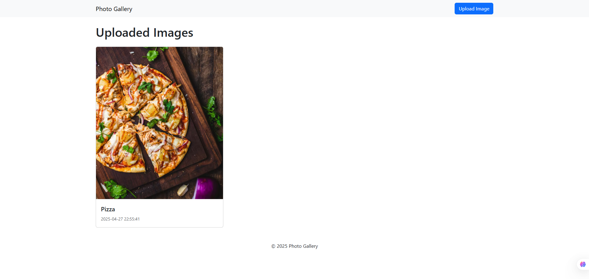
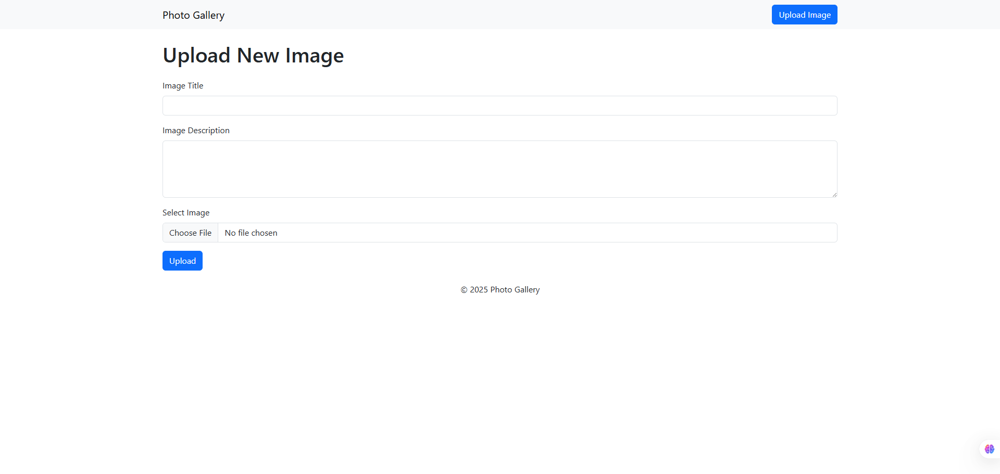

# 📸 Photo Gallery Web Application  
**Project Description**

## Overview
The **Photo Gallery Web App** is a simple web-based platform where users can **upload**, **store**, and **view images**.  
It serves as an easy way to manage and showcase a collection of photos on a website, similar to a lightweight version of services like Google Photos or Flickr — but much simpler and personal.

---

## Main Features
- **Image Uploading:**  
  Users can upload their own images through a web form. Each image has a **title** and an optional **description**.
  
- **Image Gallery Display:**  
  All uploaded images are displayed neatly on the homepage in a **grid of cards** (using Bootstrap for nice styling).

- **Database Storage:**  
  All image details (title, description, filename, upload date) are stored in a **MySQL database** for easy management.

- **Secure Uploads:**  
  Only images smaller than **5MB** are accepted. Basic security measures like file validation and safe database interactions are used.

---

## Technical Stack
- **Frontend:**  
  - HTML5
  - Bootstrap 5 (for responsive design and styling)

- **Backend:**  
  - PHP (Server-side scripting)
  - MySQL (Database for storing image data)
  - PDO (PHP Data Objects for secure database connection)

- **Folder Structure:**  
  - `assets/images/` — to save uploaded images
  - `includes/` — for reusable PHP components like config, header, footer

---

## Screenshots

## Authors

- [Kazi Maruful Islam 🤗](https://www.github.com/maruf-ux)
